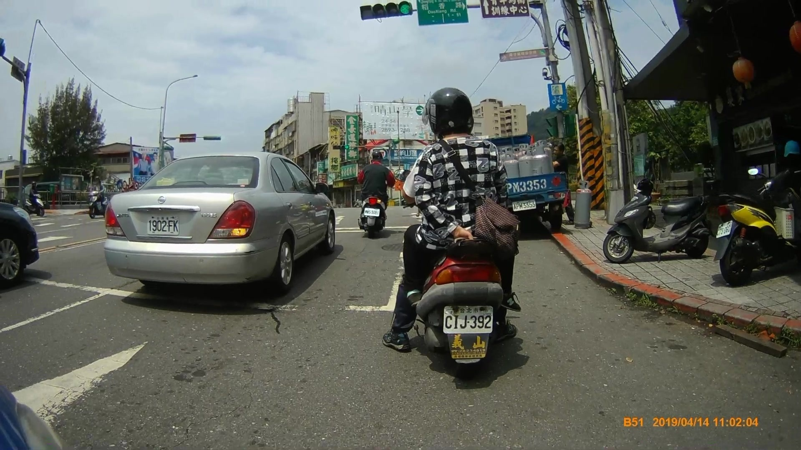

# LP2025 License Plate Dataset Overview

## Project Structure

```text
LP2025
├── LPD_confirm.py              # Visualize labels to verify annotations
├── Model.pptx                  # Project slides (model architecture, results, etc.)
├── README.md                   # (This file) project documentation
├── Statistics_of_resolution.py # Script to compute image resolution statistics
├── test/                       # Test split
│   ├── images/                 # Raw test images
│   └── labels_gd/              # Test labels (ground truth)
├── train/                      # Training split
│   ├── images/                 # Raw training images
│   └── labels_gd/              # Training labels
└── val/                        # Validation split
    ├── images/                 # Raw validation images
    └── labels_gd/              # Validation labels
````

## Files and Folders

### 1. Main Scripts

* **`LPD_confirm.py`**

  * **Purpose**: Visualization tool to confirm license plate detection (LPD) annotations.
  * **What it does**: Reads images and labels from `images` and `labels_gd`, draws bounding quadrilaterals defined by the labels onto the corresponding images, and saves the results for manual quality checks.
  * **Note**: Update the hardcoded file paths in the script before use.

* **`Statistics_of_resolution.py`**

  * **Purpose**: Computes the distribution of image resolutions across the dataset.
  * **Benefit**: Knowing the size distribution helps choose a standard input size for preprocessing before training.

* **`Model.pptx`**

  * **Contents**: The SPG project’s model architecture.

---

### 2. Dataset Splits (train / val / test)

Standard ML split:

* **`train/` (training)**: Used to fit the model; it learns plate detection and recognition from these images and labels.
* **`val/` (validation)**: Used during training to monitor performance and tune hyperparameters (e.g., learning rate) to avoid overfitting.
* **`test/` (testing)**: Held-out data for final evaluation; the model never sees these during training, so results reflect generalization.

---

### 3. Dataset Statistics

#### Image Count

| Split            | Images    |
| ---------------- | --------- |
| Train (train)    | 7,116     |
| Validation (val) | 1,779     |
| Test (test)      | 8,894     |
| **Total**        | **17,789** |

#### License Plate Annotations

* Total plate annotations: 67,429
* Avg. plates per image: ~1.87
* Readable plates: 33,240
* Unreadable plates: 34,189

#### Plate Image Distribution (by attribute)

| Split  | Total images | Readable plates | Unreadable plates |
| ------ | ------------ | --------------- | ----------------- |
| Train  | 26,881       | 13,243          | 13,638            |
| Val    | 6,756        | 3,340           | 3,416             |
| Test   | 33,792       | 16,657          | 17,135            |

LP-2025 is one of the most challenging plate datasets available, covering diverse scenes, viewpoints, and image clarity—ideal for evaluating plate detection and recognition models.

---

### 4. Label Files (`labels_gd/`)

`labels_gd` stores the image **ground truth**.

* **Naming**: Label files (e.g., `123.txt`) correspond 1:1 with image files in `images` (e.g., `123.jpg`).
* **Format**: Each `.txt` file has one or more lines, each describing one plate:

```text
[plate_string] [x1] [y1] [x2] [y2] [x3] [y3] [x4] [y4]
```

* `[plate_string]`: The plate text, e.g., `RAB-8817`.

* `[x1] [y1] ... [x4] [y4]`: Pixel coordinates of the four vertices of the plate quadrilateral.

* **Special marker `_` (underscore)**:

  * A line starting with `_` means the plate is visible but **hard or impossible to read** due to blur, occlusion, or extreme angle.
  * This tells the model: “There is a plate here; detect its location, but you don’t need to recognize the text.”
  * In `LPD_confirm.py`, these labels are drawn in **red** for clarity.

## Annotation Example

Example from the `test` folder: `36.jpg`.

* **Image path**: `test/images/36.jpg`

* **`36.jpg` contents**:



* **Label file**: `test/labels_gd/36.txt`
* **`36.txt` contents**:

```text
1902FK 354 517 430 516 429 562 353 559
CIJ392 1064 735 1182 735 1179 796 1063 796
_ 875 497 912 499 910 517 871 515
_ 1227 484 1283 477 1284 499 1229 507
_ 1724 536 1755 529 1748 561 1719 568
```

**Explanation**: `36.jpg` has 5 annotated plates:

* Three unreadable plates (marked with `_`).
* Two readable plates with IDs `1902FK` and `CIJ392`.
* Each line’s eight numbers are the (x, y) coordinates of the four vertices of the plate quadrilateral.

